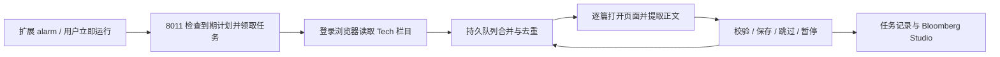

# Bloomberg Tech 自动采集设计

日期：2026-10-07。状态：v1.3.0 首版实现完成，真实登录浏览器的两轮定时验收待完成。

v1.4.1 排查更新：本机首轮 Tech 保存一篇，随后 10:42 的 Finance 定时任务已触发，但在栏目发现阶段报 `network_error`，无文章领取，不能算定时采集验收通过。扩展新增空栏目加载等待、同轮两次发现重试及失败详情；接收服务记录失败阶段。调度间隔改为数据库配置，默认 120 分钟，本机按用户要求设为 10 分钟；重启后保留，页面显示实际间隔。下文关于固定两小时的说明保留为首版设计历史，当前行为以实际配置为准。

v1.4.0 扩展至多个专栏：Tech、Finance、Economics、Big Take 参与全局每两小时一篇的轮换；AI Today 保留 newsletter 入口，明确发现文章前不启用自动采集。任务记录新增 column_id，候选保存专栏归属，URL 全局去重；原有 Tech 数据库原地迁移。网页增加专栏筛选/管理，扩展支持指定专栏手动试抓。新增独立 Takeaways 字段、来源标识和阅读/导出；历史记录需重新采集。完整使用方式见 README 的 v1.4.0 段落。

当前实现：SQLite 持久队列与 120 分钟/每轮一篇计划，扩展 alarm 与页面步骤恢复，幂等保存，暂停/恢复，UTC 过期检查，扩展操作面板及网页只读状态。实际接口为 GET `status`、POST `settings/tick/discovery/result`，通过 tick/配置完成立即运行和停止，不另设 claim/run/stop 路由。浏览器来源校验已实现，控制令牌留待下一版。历史无时区数据迁移、网页控制按钮、统一服务启动入口和真实浏览器验收未完成。下文保留完整目标设计，不能将规划接口视为已上线接口。

## 目标与边界

2 分钟连续轮换实测：Finance 在 11:44:38 领取并保存上述 HDFC Bank 文章；Economics 在 11:46:38 自动领取，保存 `Australians Are Less Vulnerable to Rate Hikes, Deutsche Says`（9 段、347 词、3 条 Takeaways，run `97bd1516-39d8-489f-a6cc-319787f58378`）。两轮之间未手动点击立即运行。每轮一篇预算和栏目轮换均已得到真实浏览器验证，正文仍为待人工核验的候选。

11:37 Finance 发现失败的详细记录确认：浏览器已跳转 `/finance`，页面有 40 个链接，但接收端只认旧 `/industries/finance`，返回 HTTP 400。修复为仅对 Finance 兼容这两个明确地址，保持 HTTPS/主站和其他栏目来源校验；按用户要求将本机间隔设为 2 分钟。11:44:38 到期后扩展自动领取 Finance 轮次，11:44:54 保存 `India’s $110 Billion HDFC Bank Faces Upheaval With Outsider CEO`（28 段、1,193 词、3 条 Takeaways，run `fe4bd769-07ef-45e6-9eef-4dec8e06072e`）。

11:22 的 Economics 轮次成功发现链接，但领取了独立 `/features/` 专题，正文容器匹配为零，未入库。队列修复后，11:27 将 Tech 验证轮次设为到期，由现有扩展 alarm 自动领取并保存 `Boston Dynamics Taps Amazon Alexa Executive as New CEO`（5 段、248 词、3 条 Takeaways，run `d4f25de7-749a-4530-9b53-28f444775545`）；验证了真实浏览器自动执行至落库，尚需后续十分钟轮换验证各专栏稳定性。

在用户已登录且有订阅的 Chrome 中，周期性读取 `https://www.bloomberg.com/technology` 的链接，对新增文章逐篇提取正文，写入现有 Bloomberg 主站库并显示在 Bloomberg Studio。Tech 归属以栏目页面实际出现的链接为准，不从全站 sitemap 猜测专栏归属。

首版支持浏览器运行、本地接收服务在线时的自动增量采集。电脑休眠或 Chrome 关闭时无法采集；恢复后补一次到期任务，不重放每个错过的周期。登录失效、机器人验证需用户处理后点击恢复。正文仍标为 `full_text_reviewed=false`，采集成功不等于逐篇全文已经核验。

## 现有实现与缺口

- `worker.js` 已有 Tech 链接发现、正文提取、逐篇新建标签页和异常结果处理，可复用提取函数。
- `bloomberg_main_bridge.py` 已有 `/columns/tech/discover`、`/queue?column=tech`、`/capture`，以及 URL 来源检查和重复正文拒收。
- 当前批次最多 10 篇，使用全局 `running`、`stopRequested` 和连续异步循环，没有持久任务进度；不能把它直接包在定时器中作为自动任务。
- 当前发现结果覆盖 `tech.json`，失败文章没有重试冷却记录；固定截取前 10 个可能让长期失败项阻塞后面的文章。
- `bloomberg_store.py` 加载时按三天过滤展示，但主站 bridge 写入并未执行物理清理；日期解析也会丢弃时区。自动化必须统一 UTC 时间处理及主站保留策略。
- 既往复抓验证为 10 次尝试、8 篇保存、2 篇跳过；长文容器适配仍是独立工作，不阻塞普通文章自动化。

## 推荐结构

Chrome 扩展负责浏览器操作和唤醒；8011 接收服务负责计划、队列、任务租约和结果记录。8000 控制台提供设置与状态展示。后台无需弹窗保持打开。

使用 `chrome.alarms`，新增 `alarms` 权限。扩展每分钟检查本地任务是否到期；按用户设定，自动采集周期为 120 分钟，每轮最多尝试 1 篇文章。在线检查不等于文章抓取。alarm 不是准点保证，实际执行时间必须展示。

Chrome 的 service worker 可以终止，内存变量不能作为任务真相。监听器在顶层注册；每次 worker 启动检查并补建 alarm。浏览器支持版本首版设为 Chrome 120+，不依赖新版本才支持的 alarm 跨会话选项。

以 `tabs.onUpdated`、`tabs.onRemoved` 和恢复 alarm 驱动逐步处理。保存当前标签页、步骤、截止时间和任务 ID，禁止一个 handler 串行跑完整批次。页面完成后分阶段检查正文是否稳定；恢复 alarm 处理丢失事件或 worker 重启。短等待可用定时器，但超时与下一步执行不能只依赖它。

## 默认产品行为

| 设置 | 首版默认值 | 含义 |
| --- | --- | --- |
| 自动采集 | 关闭 | 用户开启后开始按计划运行 |
| 专栏 | Tech | 固定官方 Technology 页面 |
| 周期 | 120 分钟（2 小时） | 每轮重新发现链接，选择一篇待采集文章 |
| 每轮上限 | 1 次文章尝试 | 失败不在本轮补抓另一篇，重试也占用后续周期的名额 |
| 并发 | 1 | 同时只处理一篇 |
| 文章间隔 | 至少 10 秒 | 从上一篇结束到下一篇打开，不宣称此值保证不触发验证 |
| 单页等待 | 最长 45 秒 | 等页面和正文就绪，超时转重试 |
| 单轮时限 | 3 分钟 | 超限结束本轮，剩余任务留待下轮 |
| 正文窗口 | 发布后 72 小时 | 与现有三天规则对齐，使用 UTC 计算 |

扩展弹窗增加自动采集开关、周期、每轮上限、立即运行、暂停、恢复和状态。8000 控制台显示最后一轮结果、下一次计划时间、浏览器最近在线时间、暂停原因和待人工检查数。时间以 Asia/Shanghai 展示，存储为带时区 UTC ISO 8601。

默认配置固定为 `interval_minutes=120`、`max_attempts_per_run=1`。首次开启后等待 2 小时执行第一轮；需要马上采集可点“立即运行”。每轮实际开始时将下一轮设为开始时间后 2 小时；空队列也推进计划。休眠恢复只补一轮，并从补跑开始重新计算 2 小时间隔。手动立即运行同样最多处理一篇，并将下一轮顺延至该轮开始后 2 小时。每轮可能保存 0 或 1 篇，不把失败尝试描述为成功采集。

自动任务默认 `active:false` 打开工作标签页，单轮只保留一个由采集器创建的标签页；必须实测后台页面正文是否正常加载。若后台加载失败，显示明确原因并允许切换前台模式，不无限重试。正常结束关闭自有标签页；遇验证保留对应页面供用户处理。绝不关闭用户原有标签页。

“停止本轮”禁止再开新文章，允许已经成功返回的正文完成写入，且关闭自动计划防止下一轮马上启动；“恢复自动采集”重新计算到期时间。手动采集、试抓与自动任务共用互斥机制，冲突时返回当前任务信息。

## 持久化与任务状态

新增 `bloomberg_tech_scheduler.py`，使用 Python 标准库 SQLite 保存调度数据至 `data/bloomberg_tech_scheduler.sqlite3`。设置、任务、候选和尝试记录用数据库事务更新，避免多个请求重复领取。数据库及运行日志加入 `.gitignore`，版本库只保存默认配置与脱敏测试夹具。

主要记录：

- settings：enabled、interval_minutes、max_attempts_per_run、配置版本、next_due_at。
- runs：run_id、trigger、state、started_at、finished_at、attempted/saved/skipped/retry 统计、pause_reason。
- candidates：normalized_url 主键、first_seen_at、last_seen_at、published_at、state、attempt_count、next_retry_at、extractor_version。
- attempts：attempt_id、run_id、URL、owner_id、lease_until、结果与正文摘要哈希；每个 attempt_id 只产生一次有效结果。

任务状态：`idle → discovering → capturing → completed`；另有 `paused_user`、`paused_auth`、`waiting_bridge`、`failed_discovery`。每篇状态为 `pending`、`leased`、`saved`、`retry_wait`、`needs_review`、`expired`。

本地数据库是任务真相；`chrome.storage.local` 仅保存扩展 owner_id、当前 run/attempt/tab ID、步骤和最后已知设置。开启配置在 bridge 保存成功后才算生效，bridge 离线时界面显示设置尚未保存。扩展即使禁用自动模式也保留低频在线检查，以便控制台启用能在一分钟内被发现。

同一时间只能有一个活动采集任务，租约 120 秒，步骤变化或一分钟恢复检查时续租。活动任务不会因新的周期另开一轮。重启后先核对租约、标签页及已确认结果，再继续；过期租约收回重试，旧 owner 提交的迟到结果必须拒绝。

正文写入仍复用现有 JSON 库，并由 bridge 的统一锁与原子替换保护。数据库与 JSON 不能假装成一个事务：写入时将 attempt_id 记到文章记录，重放时先查保存回执及文章 attempt_id；若 JSON 已落盘但数据库结果未确认，只补登记结果，不重复写入或重复计数。已有 `/capture` 手动入口兼容保留。

## 发现、增量与保留

每轮重新读取 Technology 页面，队列合并而不是覆盖未完成任务；维持首次发现顺序，新文章追加，待复抓和到期重试公平轮转，避免坏文章反复占据首批。

已保存且提取版本有效的 URL 不再抓取；明确标记 needs_recapture 或用户选择复抓的 URL 例外。失败记录独立于正文库，删除过期正文不会令旧链接重新变成新文章。栏目不再展示某链接时，已经入队且未过期的任务仍可完成；不承诺抓取 Technology 栏目的全部历史文章。

发布日期未取得前，不能根据 URL 日期假定精确发布时间。页面取得发布时间后，在 bridge 按 UTC 校验 72 小时窗口；已过期则记 `expired`，不保存正文。缺失或无效时间记 `needs_review`，自动采集不采用抓取时间冒充发布时间。现有历史数据采用显式迁移策略，不静默赋新日期。

每轮开始和写入后执行主站库物理清理，与所有主站写入共用锁；控制台读取复用同一时区函数。inbox、隔离文件按采集时间清理至 72 小时，避免正文副本无限增长。队列和尝试摘要不保留正文，保留 30 天；只要 URL 还出现在当前栏目快照，保留其去重状态，已知过期 URL 不因摘要清理再次采集。

## 异常策略

| 情况 | 行为 |
| --- | --- |
| 机器人验证、登录/订阅门槛 | 全局 `paused_auth`；保留页面；用户处理并点恢复才继续 |
| 页面超时、临时网络错误 | 每 URL 最多 3 次尝试，重试排入后续 2 小时周期并占用该轮唯一名额；耗尽进入 needs_review |
| 无正文、正文不足、长文容器未知 | needs_review，自动计划不反复采集；升级提取器后允许重试 |
| 不同 URL 正文完全相同 | 拒收并记 needs_review，保留摘要和诊断 |
| 栏目页面空或验证失败 | 不覆盖已有队列、不抓旧快照冒充本轮发现；验证则暂停，其余等下轮 |
| bridge 离线 | 不打开新采集页；下次在线检查恢复。正在处理的结果缓存至下一次提交，限制缓存大小与保留期 |
| Chrome 关闭或电脑休眠 | 暂不运行；重启后核对任务并补一轮，不累计并行任务 |
| 用户关闭工作标签页 | 自动任务暂停为 paused_user，避免反复开页干扰用户 |

发现页也必须检查登录门槛与最终 URL。文章采集必须核对预期 URL、页面 canonical URL 和元数据所属文章；当前标题和 JSON-LD 不得来自无限滚动中的其他文章。已有首正文容器选择与重复校验保留。

## 拟新增接口

所有控制入口由 bridge 执行相同校验，8000 通过服务端代理调用 8011，保持现有扩展 CORS 限制。配置更新需要 loopback 控制令牌及来源检查，不将新增控制接口开放给任意网页。

| 接口 | 用途 |
| --- | --- |
| GET/POST `/automation/tech/settings` | 读取和修改配置；修改为版本校验的事务 |
| GET `/automation/tech/status` | 计划、当前任务、统计、暂停原因、最近浏览器在线时间 |
| POST `/automation/tech/tick` | 浏览器上报在线、检查到期、原子创建或恢复一个任务 |
| POST `/automation/tech/run` | 用户立即运行，同样受任务互斥约束 |
| POST `/automation/tech/claim` | 领取发现或文章步骤，并返回带期限的租约 |
| POST `/automation/tech/discovery` | 提交本轮栏目链接，关联 run_id 和有效租约 |
| POST `/automation/tech/result` | 提交正文或诊断；校验 attempt_id、owner、租约并幂等登记 |
| POST `/automation/tech/stop` | 停止本轮并关闭自动计划，幂等操作 |
| POST `/automation/tech/resume` | 解除用户/登录暂停后恢复计划，不能凭调用认定订阅有效 |

接口返回明确的下一步类型、expected_url、attempt_id、lease_until、next_action_at；手动和自动路径使用同一采集保存函数。扩展与 bridge 增加协议版本握手，旧版本明确提示需要更新，不显示虚假成功。

## 实施顺序和验收

1. 先实现调度数据库、队列策略、互斥租约、幂等结果、UTC 保留与 API，使用临时数据目录测试，不改真实正文库。
2. 重构 worker 为可恢复步骤，加入 alarms、后台标签页、超时恢复和协议握手；手动试抓同步使用新的执行器。
3. 扩展与控制台加入设置、暂停/恢复、统计及错误详情。新增统一启动入口检查并启动 8000/8011，避免重复服务进程；开机启动作为可选部署步骤。
4. 真实登录浏览器验证两轮增量及休眠恢复，明确记录保存/跳过情况；通过后才开启周期任务。

必须验证：两个 tick 不会创建两个任务；worker/bridge 分别在领取后、正文保存后重启都能恢复；重复 result 不重复计数；停止后不再开页；坏文章不阻塞新文章；验证立即暂停；bridge 离线不打开页面；后台页加载可用；过期正文不会反复入库；UTC 和北京时间边界一致；原有手动单篇/批量测试继续通过。

端到端验收连续两轮：第一轮保存新文章；第二轮无新增时保存数为零，若新增则仅抓新增及明确到期重试。任何统计必须来自数据库回执，不能把尝试数称为成功数。

## Chrome 官方依据

- [Extension service worker lifecycle](https://developer.chrome.com/docs/extensions/develop/concepts/service-workers/lifecycle)：worker 的终止与事件恢复规则，支持采用持久状态和事件驱动执行。
- [chrome.alarms](https://developer.chrome.com/docs/extensions/reference/api/alarms)：权限、设备休眠、延迟与 alarm 恢复规则，支持启动时补建 alarm 和到期任务合并。
